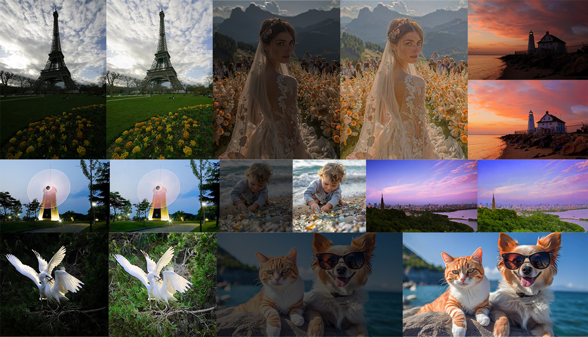
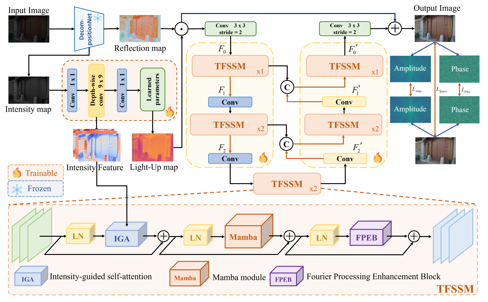
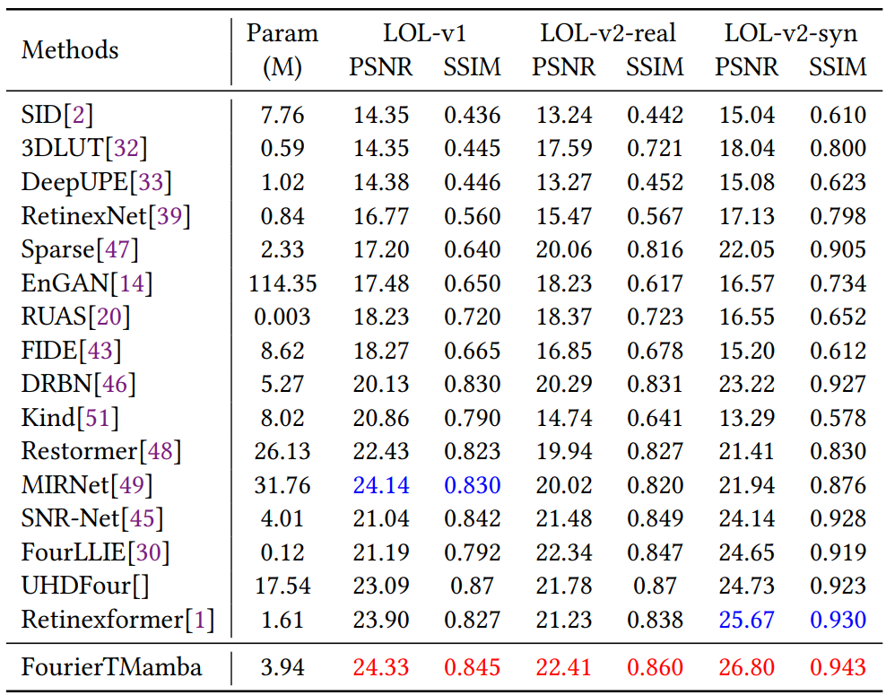
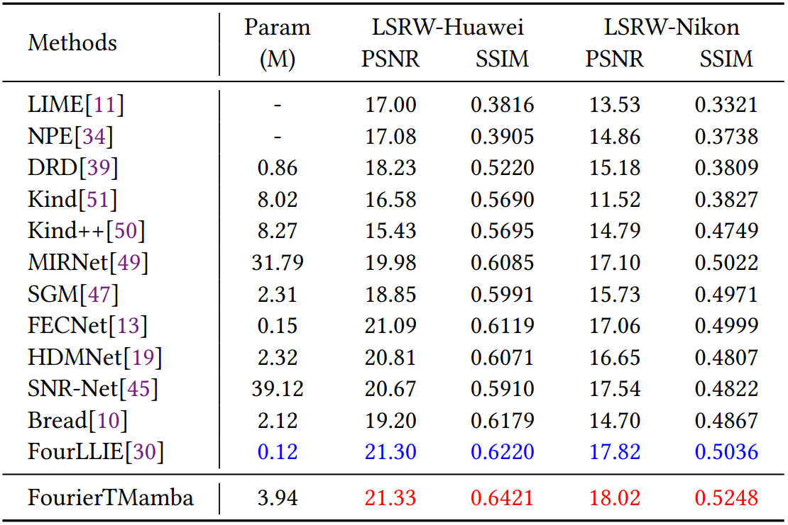
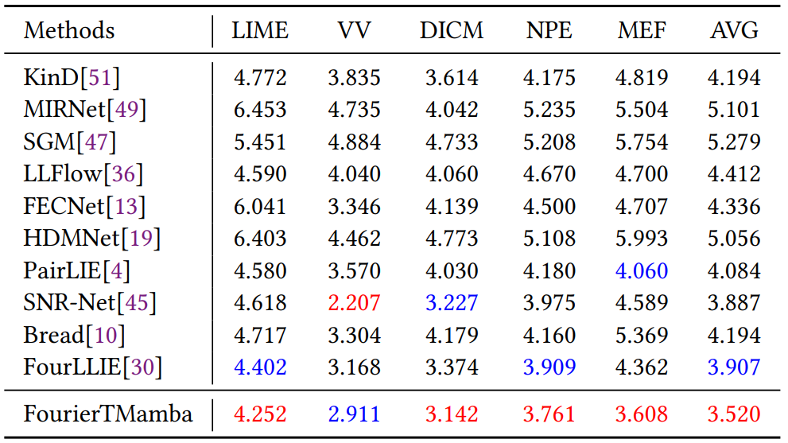

# Low-Light Image Enhancement via FourierTMamba: A HybridFrequency-Spatial Approach

> **Abstract:** Low-light image enhancement in digital imaging field is critical
for applications such as surveillance, mobile photography and autonomous driving. Currently available methods, no matter retinexbased or purely frequency-based methods, often fail to deal with
complex illumination dynamics, leading to artifacts and unnatural illuminance distribution. This paper has proposed a hybrid frequency spatial based approach named FourierTMamba, which harnesses
the strengths of Transformer, Mamba and Fourier Transform for visual details refinement and illuminance restoration. Specifically, it employs cascade strategy that integrates preliminary enhancement
based on retinex decomposition, as well as fine-grained enhancement through dual-domain hybrid structure. Comprehensive experiments on public benchmark paired and unpaired datasets have
demonstrated that the proposed FourierTMamba significantly outperforms state-of-the-art methods with relative lightweight computation burdens.


# Model structure



## Results (FourierTMamba)
# Performance results of the FourierTMamba trained on paired dataset
<summary><strong>LOL</strong> </summary>
 

<summary><strong>ViLSRW</strong></summary>
 

# Performance results of the FourierTMamba trained on paired dataset
<summary><strong>Visual Results</strong></summary>
 

### 1.Install dependencies.

```python
pip install torch==2.0.0 torchvision==0.15.1 torchaudio==2.0.1 --index-url https://download.pytorch.org/whl/rocm5.4.2
pip install packaging
pip install timm==0.4.12
pip install pytest chardet yacs termcolor
pip install submitit tensorboardX
pip install triton==2.0.0
pip install causal_conv1d==1.0.0
pip install mamba_ssm==1.0.1
pip install scikit-learn matplotlib thop h5py SimpleITK scikit-image medpy
pip install opencv-python joblib natsort tqdm tensorboard
pip install einops gdown addict future lmdb numpy pyyaml requests scipy yapf lpips
pip install fvcore
```
## 2. Prepare Dataset
Download the following datasets:

LOL-v1 [Baidu Disk](https://pan.baidu.com/s/1ZAC9TWR-YeuLIkWs3L7z4g?pwd=cyh2) (code: `cyh2`), [Google Drive](https://drive.google.com/file/d/1L-kqSQyrmMueBh_ziWoPFhfsAh50h20H/view?usp=sharing)

LOL-v2 [Baidu Disk](https://pan.baidu.com/s/1X4HykuVL_1WyB3LWJJhBQg?pwd=cyh2) (code: `cyh2`), [Google Drive](https://drive.google.com/file/d/1Ou9EljYZW8o5dbDCf9R34FS8Pd8kEp2U/view?usp=sharing)

LSRW dataset [[Baiduyun (extracted code: wmrr)]](https://pan.baidu.com/s/1XHWQAS0ZNrnCyZ-bq7MKvA)

### Unpaired datasets 
Please refer to [[Project Page of RetinexNet]](https://daooshee.github.io/BMVC2018website/).

## How to train?
For example training on LOL-v1 datasets
```
python3 basicsr/train.py --opt Options/FourierTMamba_LOL_v1.yml
```

## How to test?
```
python3 Enhancement/test_from_dataset.py --opt Options/FourierTMamba_LOL_v1.yml --weights pretrained_weights/LOL_v1.pth --dataset LOL_v1
```

## Acknowledgement
We thank the following article and the authors for their open-source codes.This repo is based on [Retinexformer ](https://github.com/caiyuanhao1998/Retinexformer) (ICCV 2023).

```
@inproceedings{Retinexformer,
  title={Retinexformer: One-stage Retinex-based Transformer for Low-light Image Enhancement},
  author={Yuanhao Cai and Hao Bian and Jing Lin and Haoqian Wang and Radu Timofte and Yulun Zhang},
  booktitle={ICCV},
  year={2023}
}
```
